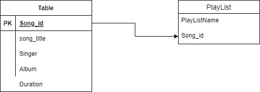

# VBI Music app
This repo provides the VBI music app backend.

## Pre-requistes:
1. Have nodejs installed
2. Have postgres installed and ready.

## Steps to start the app.
1. Clone this repo
2. Do npm install
3. Create a DB in postgres server.
4. Configure or prefill the DB by excuting the sql from this repo dbschema.sql
5. Configure the DB as env variables with below names
    a. PGUSER - Postgres user
    b. PGHOST - Postgres database host name
    c. PGDATABASE - Postgres database name
    d. PGPASSWORD - Postgres database password
    e. PGPORT - Postgress database port.
6. Start the app using the command "node main.js"

## List of API endpoints.

Certain API have basic authentication enabled. The user name is 'default' and password is 'password' for authentication right now.

| API | Description | method | body | Authentication | Sample response |
| --- | --- |--- | --- |--- | --- |
|/metrics|Provide the metrics for monitoring this app | GET | NA | No | |
|/status|Provide the current status this app | GET | NA | No | DB connected/DB not connected |
|/listsongs|List all available songs | GET | NA | No |[{"id":1,"song_title":"Valaiyosai","singer":"Ilayaraja","album":"Satya","duration":"300s"},{"id":2,"song_title":"En Jodi","singer":"Ilayaraja","album":"Vikram","duration":"283s"}] |
|/getPlayList|List all songs in a playlist | GET | {"playListName": "Krishnan" } | No |[{"id":11,"song_title":"Mallipoo2","singer":"AR Rahman","album":"VTK","duration":"283s"}]|
|/addSongToPlayList|Add songs to the playlist | POST | {"playListName": "Anantha2","song": 5 }| No |Song added to playlist|
|/shufflePlaylist|Shuffles the songs in the playlist and gives the same | GET | {"playListName": "Anantha" }| No |[{"id":5,"song_title":"Valaiyosai1","singer":"Ilayaraja","album":"Satya","duration":"300s"},{"id":1,"song_title":"Valaiyosai","singer":"Ilayaraja","album":"Satya","duration":"300s"},{"id":15,"song_title":"Mallipoo3","singer":"AR
Rahman","album":"VTK","duration":"283s"},{"id":13,"song_title":"Valaiyosai3","singer":"Ilayaraja","album":"Satya","duration":"300s"},{"id":3,"song_title":"Mallipoo","singer":"AR
Rahman","album":"VTK","duration":"283s"}]|

## DB Schema

